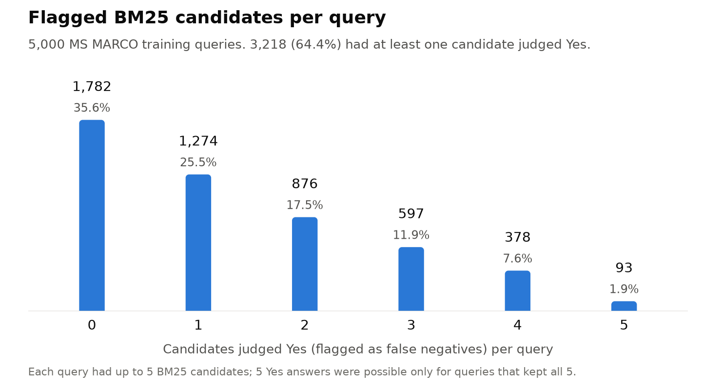

# False-Negative Filtering with a Local LLM Verifier (MS MARCO)

My part of a four-person course project, "Training a state-of-the-art embedding model" (MS in Applied Data Science, University of Chicago, Spring 2026).

I used a local LLM to check 22,537 BM25 candidate passages for 5,000 MS MARCO training queries and flag the ones that answer the query even though training would treat them as negatives. It flagged 6,794 of them (30.1%). The team's finished training runs found no measurable gain from LLM-verified data.

## The false-negative problem

Embedding models for search are usually trained contrastively. Each training example has a query, a passage labeled as answering it, and passages assumed not to answer it. The loss pulls the query's embedding toward the labeled passage and pushes it away from the others. MS MARCO typically marks only one passage per query as relevant, so other passages that also answer the query can end up on the negative side. These false negatives teach the model to push correct answers away. They are most likely among hard negatives, the passages that best match the query's words, which is what BM25 returns first. The plan for this step was to ask an LLM whether each hard-negative candidate answers the query and to drop it from the negatives if it does.

## Pipeline

**Data and candidates (a teammate's notebook, not in this repo).** The first 20,000 rows of MS MARCO v2.1 train were reduced to 12,156 rows that have a selected passage. The first selected passage became the positive and the row's other passages became negatives. Rows were shuffled with seed 42 and split 80/10/10 into 9,724 train, 1,216 dev and 1,216 test examples. BM25 (`rank_bm25`, lowercase whitespace tokens) indexed all 121,343 passages of the 12,156 rows, dev and test included. For each of the first 5,000 training queries it returned the top 5 hits, minus any passage identical to the labeled positive. 2,448 queries kept fewer than 5 candidates, which is why there are 22,537 pairs and not 25,000.

**Verifier (`run_verifier.py`).** Each (query, candidate) pair goes to Qwen3.6 35B-A3B, a mixture-of-experts model (Ollama tag `qwen3.6:35b`), served locally by Ollama on an M1 Max laptop with 64 GB of memory. The prompt asks whether the passage answers the query and requires a one-word reply, Yes or No. Decoding uses temperature 0, top_p 1 and seed 42, with at most 16 output tokens and Qwen's thinking mode off (`think=False` plus a `/no_think` directive). The parser maps the reply to Yes, No or Unknown. Four worker threads share one Ollama server. Each result is appended to `verifier_scores.jsonl` as soon as it returns, and a rerun skips pairs that already have a Yes or No, so a crash or a sleeping laptop loses only the pairs in flight. A Yes is stored as `is_false_negative: true`.

**Post-processing.** `build_filtered_train.py` writes `filtered_negatives.jsonl` with every flagged pair, and `train_pairs_filtered.jsonl` with all 9,724 training rows after deleting each flagged passage from that query's `negatives` list (exact text match). The cleaned file was meant as the input to the team's training script. `extract_examples.py` writes 20 flagged pairs with the highest query-word overlap to a markdown file for the report.

## Verifier results

| | Count | Share |
|---|---:|---:|
| Pairs judged | 22,537 | |
| Yes (flagged as false negative) | 6,794 | 30.1% |
| No | 15,743 | 69.9% |
| Unknown or error | 0 | 0% |
| Queries covered | 5,000 | |
| Queries with at least one Yes | 3,218 | 64.4% |
| Queries with every candidate Yes | 305 | 6.1% |

Every reply parsed as Yes or No. The output file starts with 44 pairs for queries 0 to 9, the smoke-test set (19 Yes). The full run resumed after them and found 6,775 more Yes, for 6,794 in total. Run on these scores, `build_filtered_train.py` writes 6,794 rows to `filtered_negatives.jsonl` and 9,724 rows, one per training example, to `train_pairs_filtered.jsonl`. The final presentation puts the run at about 4.5 hours on the laptop (slide 8).



The Yes rate falls with position in the BM25 list, from 40.1% for the first candidate to 17.2% for the fifth. It rises with word overlap, the share of the query's distinct words (lowercased, split on whitespace) that also appear in the passage:

| Query words found in the passage | Pairs | Yes rate |
|---|---:|---:|
| Under 25% | 105 | 8.6% |
| 25 to 49% | 2,766 | 18.9% |
| 50 to 74% | 12,342 | 25.8% |
| 75 to 99% | 5,594 | 34.9% |
| All of them | 1,730 | 64.6% |

Passages that repeat the query's words are more likely to answer it, so some of that rise is expected. A judge that leans on surface overlap would show the same pattern, and without human labels the two cannot be told apart.

A Yes is the model's judgment, not ground truth. No agreement rate against human labels or a second model was measured, and [docs/examples.md](docs/examples.md) includes one flag that looks wrong. The 30.1% applies to BM25 top-5 candidates, which were picked for word overlap. It is not an estimate for MS MARCO negatives in general.

### What the filter changed in the training file

`build_filtered_train.py` can only delete a flagged passage that is in that query's own negatives list. The BM25 index included each query's own row, so 11,834 candidates (52.5%) were already in that list. The verifier said Yes to 47.5% of those and to 11.0% of the 10,703 passages from other queries' rows. Of the 6,794 flagged passages, 5,622 were in the query's own negatives. The script removes 5,610 negatives (duplicate passages account for the gap) from 2,853 of the 9,724 training rows. That is 12.5% of the 44,907 negatives in the judged rows, or 6.4% of all 87,359 training negatives. The other 1,172 flagged passages were never in that query's negatives, so they appear only in `filtered_negatives.jsonl`.

The script prints the removal counts when it runs, but the original log is not in the project files. The numbers above come from replaying the scripts on a copy of the training split rebuilt from MS MARCO with the notebook's steps. The copy matches the team's split: all 22,537 scored pairs line up with it by query, and `extract_examples.py` run on it reproduces the team's example file exactly. With the team's `train.json`, `analysis/summarize_scores.py --train` should give the same counts.

## What happened downstream

Model training and evaluation were team work outside this repo. The numbers below are from the team's two presentation decks, an earlier checkpoint deck and the final deck.

| Source | Comparison | nDCG@10 | What it shows |
|---|---|---|---|
| Earlier deck, slide 8 | BGE-small baseline (no fine-tuning) vs BGE-small fine-tuned with candidate softmax and "cleaned/filtered denominators" | 0.6710 vs 0.6779 | This compares the base model with the fine-tuned model. No fine-tune on uncleaned data was reported, so the 0.0069 gain cannot be credited to cleaning. The evaluation set is described only as "the MS MARCO-style benchmark". The result does not appear in the final deck. |
| Final deck, slide 11 | Scratch model, first exact-softmax run, unverified vs verified | 0.00326 vs 0.00451 (dev) | Both near zero. The team treated this run as a trainer failure, not a result. |
| Final deck, slide 13 | Scratch model with IDF-weighted pooling, 4K split, unverified vs verified | 0.43741 vs 0.43833 (best dev) | 0.0009 apart, with no seed-to-seed spread reported. The speaker notes call them essentially identical. |
| Final deck, slide 13 | Verified arm at 20K rows | Not finished | Sized at 20,000 rows times 64 candidates, 1.28M LLM judgments. It stopped after 613 rows (566 OK, about 3%) and an estimated $0.45 of spend, when the Fireworks API was rate-limited to about 6 requests per minute and the credits ran out. |

The team's best scratch model was trained on 20K rows without LLM cleaning and reached 0.4728 dev nDCG@10 (slide 13). The deck notes its dev split differs from the 4K runs.

Slide 13 also says the verifier "found new positives in only ~8% of rows". That is a different measurement from the 30.1% above. The 30.1% is the share of (query, candidate) pairs flagged in this local run, where every candidate was a BM25 top-5 hit. The 8% is a share of training rows in the team's 4K run. The speaker notes for slide 15 credit a verifier on the Fireworks API with producing the 4K verified dataset, and the 20K version of that run was sized at 64 candidates per row. The deck does not define "new positives" or say whether the labels in this repo were used in the 4K run. The comparable row-level figures from this run are far from 8%: 64.4% of judged queries got at least one Yes, and the cleaning script changed 29.3% of all training rows.

The final deck's "Cannot claim" list includes that LLM verification "solves" retrieval, because it did not help at 4K and never finished at 20K (slide 15). Where the team compared verified and unverified training data in a finished run, the scores were nearly identical. Whether cleaning helps at a larger scale is still open.

## Examples

[docs/examples.md](docs/examples.md) shows five flagged pairs, including one that is probably a wrong Yes.

## Team and my role

Team: Manuel Arce, Sebastian Garcia, Hoon Yum, Alberto Avila.

I handled the false-negative filtering step (Person 3 in the team plan). I wrote `run_verifier.py`, `build_filtered_train.py` and `extract_examples.py`, ran the verifier on all 22,537 pairs on my laptop, and delivered the flagged pairs, the cleaned training file and the example write-up to the team. Slides 7 to 10 of the final deck report this run. The data sampling, split and BM25 candidates came from a teammate's notebook. Model training, evaluation and the Fireworks verifier runs are not part of this repo. `analysis/summarize_scores.py` was added when this repo was prepared, to recompute the numbers above and draw the figure.

## How to run

```bash
pip install -r requirements.txt

# Ollama server that accepts 4 requests at once, plus the model
OLLAMA_NUM_PARALLEL=4 OLLAMA_KEEP_ALIVE=2h ollama serve &
ollama pull qwen3.6:35b

# Inputs from the team's data notebook go in data/:
#   data/train_data_for_LLM.json   first 5,000 training queries with bm25_candidates
#   data/train.json                training split

python run_verifier.py --smoke          # first 10 queries
python run_verifier.py --workers 4      # full run; rerun the same command to resume
python build_filtered_train.py          # data/filtered_negatives.jsonl, data/train_pairs_filtered.jsonl
python extract_examples.py --n 20       # analysis/false_negative_examples.md (git-ignored)
python analysis/summarize_scores.py --train data/train.json --figure figures/flags_per_query.png
```

Run the commands from the repository root; all paths are relative to it. `run_verifier.py` also takes `--input`, `--output`, `--model` and `--limit`. Model tags on Ollama can be updated over time, so a rerun may not reproduce every answer.

```
run_verifier.py               LLM verifier over (query, candidate) pairs, resumable
build_filtered_train.py       flagged-pair file and cleaned training file
extract_examples.py           highest-overlap flagged pairs to markdown
analysis/summarize_scores.py  counts in this README and the figure
docs/examples.md              five example pairs
figures/flags_per_query.png   flagged candidates per query
```

## Data and license

This repo contains no data files. MS MARCO is released by Microsoft for non-commercial research purposes only ([terms](https://microsoft.github.io/msmarco/)). It is available on [Hugging Face](https://huggingface.co/datasets/microsoft/ms_marco) (config `v2.1`). The scored pairs, the flagged pairs and the cleaned training file are derived from MS MARCO and are not redistributed here. `docs/examples.md` quotes short excerpts from five example pairs for illustration.
